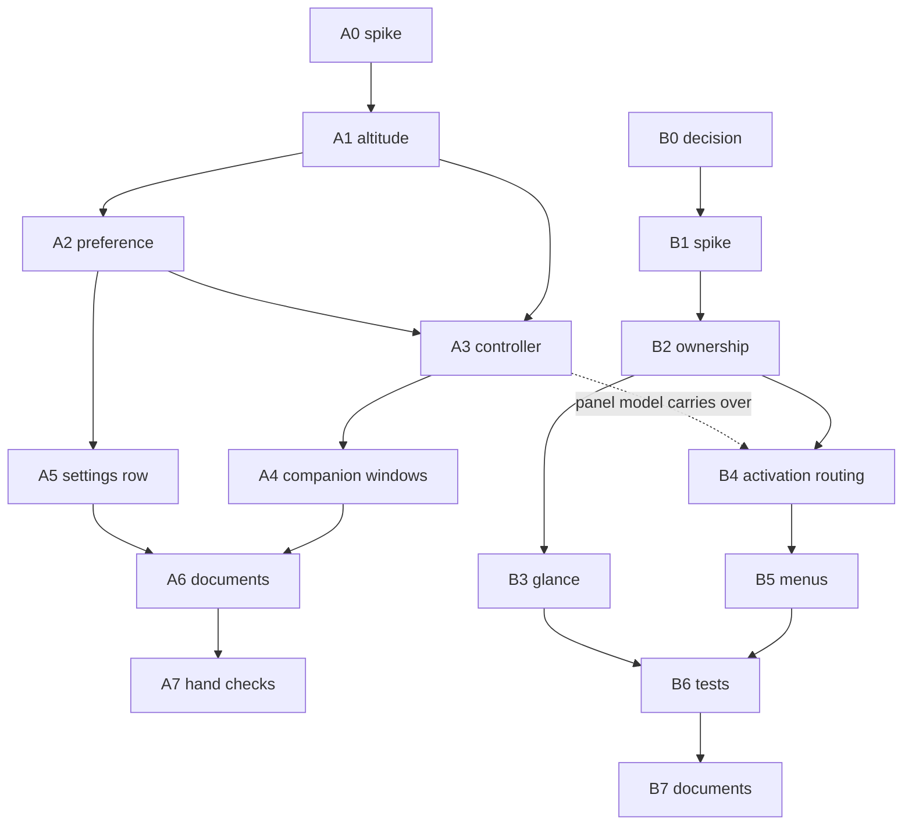

# Window roles: normal stacking now, primary editor next

**Status:** Active, 2026-09-17. Decision #191 closed 2026-09-18.
**Tracking:** [#192](https://github.com/onetimesecret/macos/issues/192)
**Sources:** [ADR-0032](../adr/0032-inactive-raised-surfaces-follow-normal-app-stacking.md) (accepted), [ADR-0033](../adr/0033-separate-the-primary-editor-from-the-ambient-panel.md) (accepted 2026-09-18, narrowed).
**Source of execution status:** GitHub issues once filed, not this document.

## Goal

Track A makes the code match ADR-0032: a raised surface that loses the keyboard drops to normal window level unless Pin or the keep above preference says otherwise.

Track B took ADR-0033 from proposed to accepted under decision issue #191. The ADR decides the roles, ownership rule and activation model. Whether the implementation sequence B1 to B7 is filed and pursued, and in what shape, is a separate call.

Track A is small and ships alone. Track A is not wasted by ADR-0033: the three fact model stays with the ambient panel.

## Current state

Nothing of ADR-0032 is implemented. PR 183 changed documents only.

- `BackdropStance.level(pinned:)` returns `.floating` for every raised surface (`shell/Sources/OnetimePad/BackdropStance.swift:24`).
- `windowDidBecomeKey` and `windowDidResignKey` only set `model.holdsKeys` (`BackdropWindowController.swift:680`, `:703`). Level is written in `apply(_:)` and in the pin sink, nowhere else.
- No keep above preference exists in the model, in defaults, or in Settings.
- Settings picks its level once, at `show()`, from `stance == .raised || pinned` (`BackdropSettingsWindow.swift:138`). About gets no level rule at all (`BackdropApp.swift:756`).
- `BackdropStanceTests` pins raised as floating at lines 63 and 165.
- The background surface spec already carries the altitude table (commit `1f9d87d`).

For ADR-0033, the one presentation assumption runs deep in the views and shallow in persistence:

- One `NSTextStorage` per page with exactly one layout manager, enforced by `Coordinator.shedLayoutManagers` (`InkEditorView.swift:1852`) at every mount and swap, and one storage delegate (`:204`). A second `InkEditorView` on the same page loses its layout manager at the other window's next mount. The resting card uses this same editor with `readOnly: true`, so even a read only second window collides.
- `PageModel` holds about twenty presentation fields with no owner: `activeEditor` (`PageModel.swift:985`), `performSealedPaste` (`:633`), `onAnchorToday` (`:1017`), `rollGeometry` (`:1049`), `holdsKeys` (`:610`), `selection`, `selectedFile`, `activeTarget`, `showingLedger`, `pasteboardOffer`, the redraw timer. Mount sites write them last writer wins.
- Menu actions route to the key window's first responder, but menu enablement reads `activeEditor`. With two windows these can name different editors.
- ADR-0006 and `DayScrollView.swift:30` state the one editor rule as contract. ADR-0033 as proposed did not cite it. As accepted it depends on ADR-0006, and the second eject trigger does not fire, because one owner at a time keeps one mounted editor.
- Persistence, Keychain scope and `FormFactor` are already single and window agnostic. "One document model" costs nothing there.
- The archived panel's `WindowRootView.swift` (87 lines, `git show 3623416^:shell/Sources/CompanionApp/Views/WindowRootView.swift`) is a usable skeleton for the new window's root view.

## Feedback on ADR-0032

1. **The keep above preference has a narrow window. Decided 2026-09-17: it stays.** The outside click monitor stays installed for as long as the surface is raised, so the first mouse press in the other application rests the card to desktop level whatever the preference says. The preference changes what happens between ⌘Tab and that first press, and during a keyboard only stay. The hand checks in A7 should state this so nobody reads the rest as a defect. The same fact softens the first consequence bullet: the raised stance survives the round trip only if no press lands elsewhere, and the editing context survives regardless because ⌘Tab back is an `.activation` raise that never anchors the roll.
2. **"About to take keys" needs a failure path.** `makeKeyAndOrderFront` can be refused (a modal is up). The surface would then sit floating and keyless with no resign key event to lower it. Add: reconcile altitude against `isKeyWindow` one turn after a raise.
3. **The companion window rule is loose and must be live.** State it as: a companion window's level equals the surface's keyless altitude. It must reapply while the window is open, because the preference toggle lives inside Settings, and flipping it would lift a raised keyless card over the Settings window that holds the keyboard. About needs the same rule and has none today.
4. **Spike before build.** Eject trigger 1 is a real race: a level write restacks the panel within its new level, and if that lands after the newly active application has ordered its windows front, the card ends above them. The hotkey raised route (our app never active, ⌘Tab from A to B) is the likeliest place to see it.
5. **The exposure gate will now see raised surfaces often.** A normal level raised card gets covered routinely, and `ignoresMouse(pinned:exposure:)` closes the gate on it. That is correct, but it was rare before and deserves a hand check: a press on a partly covered card must key it and lift it.
6. Nit: the front matter comment omits `needs-review` from its value list. The linter passes.

## Feedback on ADR-0033

All six items were taken into the accepted ADR on 2026-09-18, with three corrections found while checking them against the code and the record. ADR-0006's second eject trigger did not fire: exclusive ownership is what keeps it from firing. The panel is not read only: it may edit while it owns, and a read only panel stays available as a policy on the same model. A modal return and a cancelled quit go back to the owner, not always to the editor window. The items are kept below as written.

1. **Narrow "two live presentations" to one owner at a time.** The code cannot show one page live in two windows without reopening ADR-0006. The affordable reading: exactly one window owns the live page content; the other shows a glance built from private storages (the `QuietRendering` pattern, already sanctioned for quiet days) or shows nothing. This answers open question 1 (the ambient panel is a glance that hands off) and pre-empts eject trigger 3.
2. **Cite ADR-0006, ADR-0020 and ADR-0014.** ADR-0010 Amendment 1 argued against merging two apps with opposite activation policies, separate TCC identities and separate stores. The panel app is archived and the process is already `.regular` with one store, so three of its four arguments no longer apply. Only the launch story remains: a login launch must show the ambient panel only, never open the editor window. That settles half of open question 2.
3. **"Restoration" needs a limit.** AppKit state restoration writes window state and snapshots to Saved Application State. That conflicts with the persistence model (ADR-0012, ADR-0016) and with capture exclusion. The decision should say: frame autosave only, `isRestorable = false`, `sharingType = .none` on the new window.
4. **⌘W collides.** The keymap binds it to `pageClose`. A conventional window expects it to close the window. The ADR's open question 3 should name this case.
5. **`NSApp.deactivate()` on rest** (`BackdropWindowController.swift:398`) would deactivate the app under an open editor window. Every route that raises the panel today as an activation (⌘Tab, Dock, reopen, modal return, cancelled quit) must move to the editor window; hotkey, status item and the resting card's click stay with the panel.
6. Accepting ADR-0033 weakens ADR-0032's preference further: ⌘Tab would select the editor window, so the panel reaches raised and keyless only from a hotkey summon.

## Track A: implement ADR-0032

One PR, one commit per task. Shell only; no Rust or FFI version change.

- **A0. Hardware spike (gates the rest).** Throwaway branch: lower to `.normal` in `windowDidResignKey` when raised and unpinned. Check ⌘Tab from an active app, the hotkey raised route, Stage Manager, another app's full screen Space, a second display. Log the panel's index in `CGWindowListCopyWindowInfo` front to back order against the frontmost app's first layer 0 window, so the verdict is in the log and not judged by eye. Decide whether lowering needs an explicit `order(.below, relativeTo:)`.
- **A1. Pure altitude.** `BackdropAltitude` (desktop, normal, floating) with `resolve(stance:keyed:pinned:keepsAbove:)` and `level`. Replace `BackdropStance.level(pinned:)`. Add `keylessAltitude` for companion windows. Tests cover the whole matrix and replace the two raised is floating assertions.
- **A2. Preference.** `BackdropModel.keepsAboveWhenInactive`, persisted beside `restingPinned`, never on `PageModel`. Tests inject a throwaway defaults domain.
- **A3. Controller.** Reapply level on become key, resign key, pin, preference and stance. `apply(.raised)` resolves with `keyed: true` before ordering. The key delegate paths write level and the full screen bit, which follows the altitude (ADR-0034, after the A0 spike failed the full screen route), never frame, membership or ordering. Each write is guarded, so a pinned or keep above card writes nothing on a key transition. The writes and the stance they are judged against live in `BackdropAltitudeKeeper`, which is tested against a window that never reaches the screen. Two hazards:
  - `@Published` emits on `willSet`, and the key relay inside `apply(.resting)` makes the panel resign key synchronously. A delegate that reads `model.stance` there still sees `.raised` and would park a resting surface at `.normal`. The controller must resolve from the stance it last applied.
  - Reconcile against `isKeyWindow` a turn after each raise (feedback 2).
- **A4. Companion windows.** Settings and About take `keylessAltitude`, reapplied while open. Pure function plus test. Both follow through one `CompanionLevelFollower`, whose sinks use the emitted value for the input that is changing.
- **A5. Settings row.** `GeneralSettingsView` takes an optional `Binding<Bool>` the way it takes `resetSurface`. Label exactly as the ADR gives it; caption says Pin overrides.
- **A6. Documents.** Type and controller header comments, `docs/aesthetic.md:28`, new cases in `docs/qa/verification-procedures/spaces-and-cmd-tab.md`, CHANGELOG, ADR citation sweep.
- **A7. Hand checks owed.** ⌘Tab away and back on one desktop; hotkey raise then ⌘Tab between two other apps; press on a partly covered card; Settings opened by ⌘, by menu and by status item with Pin on and off; open panel round trip; Stage Manager.

## Track B: ADR-0033

B0 is decided. B1 to B7 below are a draft implementation sequence written while the decision was being made, kept for reference. They are not agreed work; each one is a separate call that a maintainer would take before filing, and the shape may still change.

- **B0. Decision issue (label `decision`). Decided 2026-09-18: accepted, narrowed.** One window owns the live page content at a time and the other shows a glance or nothing. Ownership is explicit and transferable: the panel owns while it is raised or while the editor window is closed, and the editor window owns otherwise. The panel may edit while it owns. Launch is decided by route: login shows the panel only, a person's launch, the Dock, reopen and ⌘Tab select the editor window, and the hotkey, the status item and the resting card's click stay with the panel. ⌘W stays `page::Close` and ⇧⌘W closes the window. The panel is a persistent preference, default on, behind a removable boundary. The editor window keeps frame autosave only. The supersession is recorded in both directions in the ADRs.
- **B1. Spike (label `prototype`).** `PrimaryEditorWindowController`: titled, resizable, normal level, ordinary Space membership, may become main, frame autosave, `isRestorable = false`, `sharingType = .none` under the same capture opt out as the panel, and a title that names the app and never page content. Root view is a stack over the strip, `PageContentView`, `PageStatusStack` and `PageKeyboardMap`. Exclusive ownership by the crudest means: while the window is open the panel rests and unmounts its content. The crude form stands for the spike only. This is enough to dogfood eject triggers 1 to 3 before B2 is built.
- **B2. Presentation ownership in CompanionKit.** One explicit, transferable owner for `activeEditor`, `performSealedPaste`, `onAnchorToday`, `rollGeometry`, `holdsKeys`, the redraw cadence, the pasteboard offer and the `PageKeyboardMap` mount. The owner is a pure function of panel stance and whether the editor window is open, with tests over the whole matrix. Key status passing to Settings, About or a modal moves nothing. Mount sites check ownership instead of writing last. Caret and scroll move from the editor coordinator to the model so a hand off keeps the person's place. A read only panel must be one policy switch on this model. Extend `EditorHandoffTests` and `EditorFactoryTests`. This is the expensive task.
- **B3. Glance for the window that does not own. Required.** Private storages from `QuietRendering`, never a second editor on a live storage. Both directions: the resting card stays readable while the editor window owns, and the editor window shows a glance while a summoned panel owns.
- **B4. Activation routing.** Split `activationRaises`: a person's launch, the Dock, reopen and ⌘Tab select the editor window, opening it when closed; summons go to the panel; a login launch opens nothing. A modal return and the cancelled quit line go back to the owner. `NSApp.deactivate()` on rest does not fire while the editor window is visible; the keyboard returns to the editor window instead. The editor window taking the keyboard rests a raised panel. Closing the editor window with no other window of ours up hands the activation back. The ambient panel preference, default on, with the hotkey and status item selecting the editor window when it is off.
- **B5. Menus and commands.** A Window menu. ⌘W stays `page::Close`; a new `window::Close` command on `cmd-shift-w`, which the default keymap leaves free. Enablement reads the owner's editor. The panel stays out of the Window menu.
- **B6. Tests and procedures divided** between primary window and ambient panel (`LaunchStanceTests`, `OutsidePressTests`, `BackdropStanceTests`, the Spaces procedure). New hand checks: ⌘Tab from another desktop goes to the editor window's desktop, and a pinned card floats above the editor window.
- **B7. Documents.** The ADR supersession is done (ADR-0010 Amendment 1, ADR-0019, ADR-0032, and the note on ADR-0006). Still owed: a new feature spec for the primary editor; the background surface spec; the code comments that state the one editor rule (`DayScrollView.swift`, `InkEditorView.swift`); CHANGELOG; the ADR citation sweep.

## Dependencies

## Epic shape

One epic, [#192](https://github.com/onetimesecret/macos/issues/192). B0 closed with an acceptance on 2026-09-18. Whether B1 to B7 are filed, and in what shape, is a separate call. Numbers land in this table if and when they do.

| Task | Issue |
| --- | --- |
| A0 spike | [#184](https://github.com/onetimesecret/macos/issues/184) |
| A1 pure altitude | [#185](https://github.com/onetimesecret/macos/issues/185) |
| A2 and A5 preference and Settings row | [#186](https://github.com/onetimesecret/macos/issues/186) |
| A3 controller | [#187](https://github.com/onetimesecret/macos/issues/187) |
| A4 companion windows | [#188](https://github.com/onetimesecret/macos/issues/188) |
| A6 documents | [#189](https://github.com/onetimesecret/macos/issues/189) |
| A7 hand checks | [#190](https://github.com/onetimesecret/macos/issues/190) |
| B0 decision | [#191](https://github.com/onetimesecret/macos/issues/191) |
