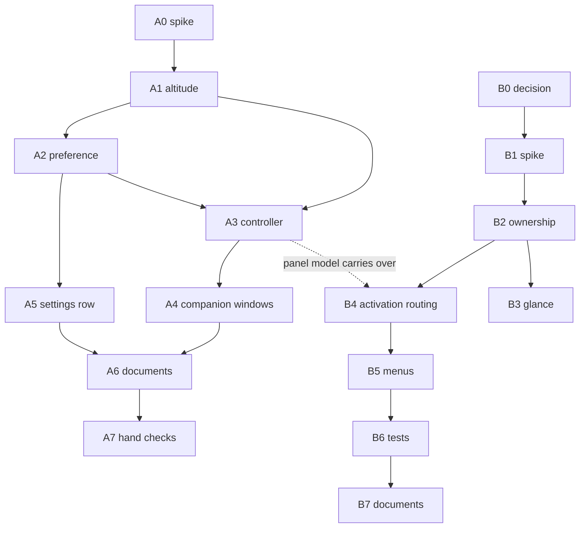

# Window roles: normal stacking now, primary editor next

**Status:** Draft workplan, 2026-09-17. Not yet an epic.
**Sources:** [ADR-0032](../adr/0032-inactive-raised-surfaces-follow-normal-app-stacking.md) (accepted), [ADR-0033](../adr/0033-separate-the-primary-editor-from-the-ambient-panel.md) (proposed).
**Source of execution status:** GitHub issues once filed, not this document.

## Goal

Track A makes the code match ADR-0032: a raised surface that loses the keyboard drops to normal window level unless Pin or the keep above preference says otherwise.

Track B takes ADR-0033 from proposed to a decision, and if accepted, to a conventional `NSWindow` editor beside the ambient panel.

Track A is small and ships alone. Track B is epic sized and is gated on a decision issue. Track A is not wasted by Track B: the three fact model stays with the panel.

## Current state

Nothing of ADR-0032 is implemented. PR 183 changed documents only.

- `BackdropStance.level(pinned:)` returns `.floating` for every raised surface (`shell/Sources/OnetimePad/BackdropStance.swift:24`).
- `windowDidBecomeKey` and `windowDidResignKey` only set `model.holdsKeys` (`BackdropWindowController.swift:630`, `:639`). Level is written in `apply(_:)` and in the pin sink, nowhere else.
- No keep above preference exists in the model, in defaults, or in Settings.
- Settings picks its level once, at `show()`, from `stance == .raised || pinned` (`BackdropSettingsWindow.swift:138`). About gets no level rule at all (`BackdropApp.swift:711`).
- `BackdropStanceTests` pins raised as floating at lines 63 and 165.
- The background surface spec already carries the altitude table (commit `1f9d87d`).

For ADR-0033, the one presentation assumption runs deep in the views and shallow in persistence:

- One `NSTextStorage` per page with exactly one layout manager, enforced by `Coordinator.shedLayoutManagers` (`InkEditorView.swift:1617`) at every mount and swap, and one storage delegate (`:122`). A second `InkEditorView` on the same page loses its layout manager at the other window's next mount. The resting card uses this same editor with `readOnly: true`, so even a read only second window collides.
- `PageModel` holds about twenty presentation fields with no owner: `activeEditor` (`PageModel.swift:954`), `performSealedPaste` (`:606`), `onAnchorToday` (`:985`), `rollGeometry` (`:1017`), `holdsKeys` (`:591`), `selection`, `selectedFile`, `activeTarget`, `showingLedger`, `pasteboardOffer`, the redraw timer. Mount sites write them last writer wins.
- Menu actions route to the key window's first responder, but menu enablement reads `activeEditor`. With two windows these can name different editors.
- ADR-0006 and `DayScrollView.swift:30` state the one editor rule as contract. ADR-0033 fires ADR-0006's second eject trigger and does not cite it.
- Persistence, Keychain scope and `FormFactor` are already single and window agnostic. "One document model" costs nothing there.
- The archived panel's `WindowRootView.swift` (87 lines, `git show 3623416^:shell/Sources/CompanionApp/Views/WindowRootView.swift`) is a usable skeleton for the new window's root view.

## Feedback on ADR-0032

1. **The keep above preference is nearly unobservable. Recommend dropping it.** The outside click monitor stays installed for as long as the surface is raised, so the first mouse press in the other application rests the card to desktop level whatever the preference says. The preference only changes what happens between ⌘Tab and that first press, or during a keyboard only stay. Pin is the real companion mode. Dropping it removes tasks A2 and A5 and half of the A1 matrix. The same fact softens the first consequence bullet: the raised stance survives the round trip only if no press lands elsewhere, and the editing context survives regardless because ⌘Tab back is an `.activation` raise that never anchors the roll.
2. **"About to take keys" needs a failure path.** `makeKeyAndOrderFront` can be refused (a modal is up). The surface would then sit floating and keyless with no resign key event to lower it. Add: reconcile altitude against `isKeyWindow` one turn after a raise.
3. **The companion window rule is loose and must be live.** State it as: a companion window's level equals the surface's keyless altitude. It must reapply while the window is open, because the preference toggle lives inside Settings, and flipping it would lift a raised keyless card over the Settings window that holds the keyboard. About needs the same rule and has none today.
4. **Spike before build.** Eject trigger 1 is a real race: a level write restacks the panel within its new level, and if that lands after the newly active application has ordered its windows front, the card ends above them. The hotkey raised route (our app never active, ⌘Tab from A to B) is the likeliest place to see it.
5. **The exposure gate will now see raised surfaces often.** A normal level raised card gets covered routinely, and `ignoresMouse(pinned:exposure:)` closes the gate on it. That is correct, but it was rare before and deserves a hand check: a press on a partly covered card must key it and lift it.
6. Nit: the front matter comment omits `needs-review` from its value list. The linter passes.

## Feedback on ADR-0033

1. **Narrow "two live presentations" to one owner at a time.** The code cannot show one page live in two windows without reopening ADR-0006. The affordable reading: exactly one window owns the live page content; the other shows a glance built from private storages (the `QuietRendering` pattern, already sanctioned for quiet days) or shows nothing. This answers open question 1 (the ambient panel is a glance that hands off) and pre-empts eject trigger 3.
2. **Cite ADR-0006, ADR-0020 and ADR-0014.** ADR-0010 Amendment 1 argued against merging two apps with opposite activation policies, separate TCC identities and separate stores. The panel app is archived and the process is already `.regular` with one store, so three of its four arguments no longer apply. Only the launch story remains: a login launch must show the ambient panel only, never open the editor window. That settles half of open question 2.
3. **"Restoration" needs a limit.** AppKit state restoration writes window state and snapshots to Saved Application State. That conflicts with the persistence model (ADR-0012, ADR-0016) and with capture exclusion. The decision should say: frame autosave only, `isRestorable = false`, `sharingType = .none` on the new window.
4. **⌘W collides.** The keymap binds it to `pageClose`. A conventional window expects it to close the window. The ADR's open question 3 should name this case.
5. **`NSApp.deactivate()` on rest** (`BackdropWindowController.swift:319`) would deactivate the app under an open editor window. Every route that raises the panel today as an activation (⌘Tab, Dock, reopen, modal return, cancelled quit) must move to the editor window; hotkey, status item and the resting card's click stay with the panel.
6. Accepting ADR-0033 weakens ADR-0032's preference further: ⌘Tab would select the editor window, so the panel reaches raised and keyless only from a hotkey summon.

## Track A: implement ADR-0032

One PR, one commit per task. Shell only; no Rust or FFI version change.

- **A0. Hardware spike (gates the rest).** Throwaway branch: lower to `.normal` in `windowDidResignKey` when raised and unpinned. Check ⌘Tab from an active app, the hotkey raised route, Stage Manager, another app's full screen Space, a second display. Log the panel's index in `CGWindowListCopyWindowInfo` front to back order against the frontmost app's first layer 0 window, so the verdict is in the log and not judged by eye. Decide whether lowering needs an explicit `order(.below, relativeTo:)`.
- **A1. Pure altitude.** `BackdropAltitude` (desktop, normal, floating) with `resolve(stance:keyed:pinned:keepsAbove:)` and `level`. Replace `BackdropStance.level(pinned:)`. Add `keylessAltitude` for companion windows. Tests cover the whole matrix and replace the two raised is floating assertions.
- **A2. Preference (delete if feedback 1 is taken).** `BackdropModel.keepsAboveWhenInactive`, persisted beside `restingPinned`, never on `PageModel`. Tests inject a throwaway defaults domain.
- **A3. Controller.** Reapply level on become key, resign key, pin, preference and stance. `apply(.raised)` resolves with `keyed: true` before ordering. The key delegate paths write level only, never frame, `collectionBehavior` or ordering. Two hazards:
  - `@Published` emits on `willSet`, and the key relay inside `apply(.resting)` makes the panel resign key synchronously. A delegate that reads `model.stance` there still sees `.raised` and would park a resting surface at `.normal`. The controller must resolve from the stance it last applied.
  - Reconcile against `isKeyWindow` a turn after each raise (feedback 2).
- **A4. Companion windows.** Settings and About take `keylessAltitude`, reapplied while open. Pure function plus test.
- **A5. Settings row (delete with A2).** `GeneralSettingsView` takes an optional `Binding<Bool>` the way it takes `resetSurface`. Label exactly as the ADR gives it; caption says Pin overrides.
- **A6. Documents.** Type and controller header comments, `docs/aesthetic.md:28`, new cases in `docs/qa/verification-procedures/spaces-and-cmd-tab.md`, CHANGELOG, ADR citation sweep.
- **A7. Hand checks owed.** ⌘Tab away and back on one desktop; hotkey raise then ⌘Tab between two other apps; press on a partly covered card; Settings opened by ⌘, by menu and by status item with Pin on and off; open panel round trip; Stage Manager.

## Track B: ADR-0033

- **B0. Decision issue (label `decision`).** Answer the five open questions, take or reject the feedback above, amend the ADR, accept or reject. Nothing below is filed until this closes.
- **B1. Spike (label `prototype`).** `PrimaryEditorWindowController`: titled, resizable, normal level, may become main, frame autosave, `sharingType = .none`, not restorable. Root view is a stack over the strip, `PageContentView`, `PageStatusStack` and `PageKeyboardMap`. Exclusive ownership by the crudest means: while the window is open the panel rests and unmounts its content. This is enough to dogfood eject triggers 1 and 2 before paying for B2.
- **B2. Presentation ownership in CompanionKit.** One owner at a time for `activeEditor`, `performSealedPaste`, `onAnchorToday`, `rollGeometry`, `holdsKeys`, the redraw cadence, the pasteboard offer and the `PageKeyboardMap` mount. Mount sites check ownership instead of writing last. Extend `EditorHandoffTests` and `EditorFactoryTests`. This is the expensive task.
- **B3. Glance for the window that does not own.** Private storages from `QuietRendering`, so the resting card stays readable while the editor window is open. Skip if B0 decides the panel hides instead.
- **B4. Activation routing.** Split `activationRaises`: activations go to the editor window, summons to the panel. Re-point reopen, modal return and the cancelled quit line. Remove the `NSApp.deactivate()` on rest while the editor window is visible. Hand off gesture from panel to editor.
- **B5. Menus and commands.** Window menu, the ⌘W decision, enablement read from the owner's editor.
- **B6. Tests and procedures divided** between primary window and ambient panel (`LaunchStanceTests`, `OutsidePressTests`, `BackdropStanceTests`, the Spaces procedure).
- **B7. Documents.** Supersession recorded in both directions for ADR-0010 Amendment 1, ADR-0019 (scoped to the panel), ADR-0032 and ADR-0006; a new feature spec for the primary editor; background surface spec; CHANGELOG.

## Dependencies

## Epic shape

One epic, "Window roles". Sub-issues A0 to A7 and B0 filed at once; B1 to B7 filed when B0 closes with an acceptance.
