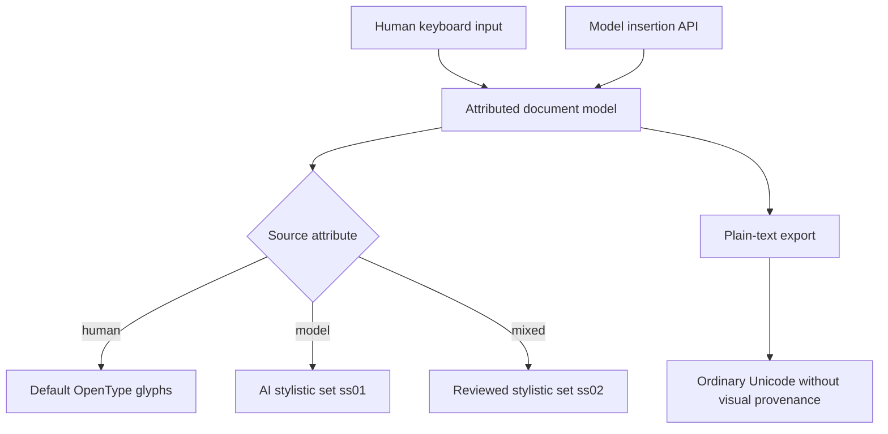

# docs/research/2026-0904-opentype-ai-font.md

---

> What I'm talking about (but perhaps using imprecise terminology) is if there is a font that can an AI can write in and a human can write in, but the characters are different either by style (e.g. like we have style and weight, there could be another for AI-source like a dotted underline) or preferably the characters can be represented differently more like ligatures but still alphanumeric characters (for latin languages)
 

What you describe is feasible, but the missing component is not the glyph design. It is a persistent per-character source attribute that selects an alternate glyph set. I’ll check whether an existing font or standard already implements that distinction.

Yes. What you describe is **attributed text rendered through alternate OpenType glyphs**. UTF-8 remains ordinary Latin text; the renderer selects different glyphs based on authorship metadata.

## OpenType approach

A custom font could contain two glyph sets:

```text
U+0061 "a" + default shaping  → a.default
U+0061 "a" + AI feature      → a.ai
```

Both remain the character `a`. The AI form could have a dotted baseline, altered terminals, perforated strokes, or another systematic distinction.

Two OpenType mechanisms fit:

### 1. Stylistic set — recommended

Define AI-source glyphs under an OpenType stylistic set such as `ss01`.

```css
[data-source="model"] {
  font-feature-settings: "ss01" 1;
}
```

This resembles ligature processing: the shaping engine receives normal characters plus a feature selection and substitutes alternate glyphs.

Human text:

```text
ordinary Unicode → default glyphs
```

Model text:

```text
ordinary Unicode + ss01 → AI alternate glyphs
```

A second set such as `ss02` could represent mixed or human-reviewed model text.

### 2. Custom variable-font axis

A variable font can define a private axis such as:

```text
"AUTH" 0  → human
"AUTH" 1  → model
```

Then a renderer selects:

```css
font-variation-settings: "AUTH" 1;
```

This could interpolate between forms, but authorship is categorical. A stylistic set therefore expresses the distinction more accurately.

## The required metadata layer

A font cannot determine authorship itself. The editor must retain source information for each text range:

```json
{
  "text": "Compaction bounds locally reconstructible content.",
  "runs": [
    {
      "start": 0,
      "end": 55,
      "source": "model"
    }
  ]
}
```

The rendering pipeline maps `source: model` to `ss01`. The AI does not label its own output; the application labels the characters inserted through the model interface.

Edits need defined transitions:

- Human typing → human
- Model insertion → model
- Human modifies model text → mixed, or split into smaller source ranges
- Paste without provenance → unknown
- Copy between provenance-aware documents → preserve attributes
- Export to plain text → retain words but lose attribution

## If the distinction must survive plain-text copying

Unicode variation selectors could technically encode an alternate after each character:

```text
a + variation selector → a.ai
```

A custom font could map those sequences to alternate glyphs. Unsupported fonts would usually display the base Latin character.

I would not use this as the primary representation. Unregistered variation sequences may be stripped or mishandled by normalization, search, diff tools, cursor movement, sanitizers, and copy/paste. Mathematical alphanumeric characters and Private Use Area characters create worse accessibility and interoperability problems.

## Practical design

The sound architecture is:



So the answer is **yes**, using ordinary alphanumeric characters and alternate OpenType glyphs is feasible. The essential invention would be a provenance-aware editor/document format plus a font with a dedicated stylistic set. I do not know of an established font or standard that already implements human-versus-model source this way; the attempted web search was unavailable, so I could not verify whether an experimental implementation now exists.


## Why OpenType?

Because the examples—weight, style, ligatures, and alternate alphanumeric forms—map directly to OpenType capabilities:

- **Weight/style:** variable-font axes
- **Alternate letterforms:** stylistic sets and glyph substitution
- **Ligatures:** contextual substitution
- **Same Unicode characters, different appearance:** font shaping

The real design space has three distinct layers:

1. **Provenance representation**  
   Records whether each range came from a person, model, or both.

2. **Persistence**  
   Stores provenance in rich-text attributes, markup, a sidecar file, variation sequences, or distinct code points.

3. **Visualization**  
   Uses another font, alternate glyphs, underlining, color, texture, margins, or editor decorations.

OpenType addresses only the third layer. It cannot determine or authenticate authorship, and by itself it does not preserve the distinction in plain text.

The alternatives depend on what “characters are different” means:

- **Same code points, different glyphs:** OpenType, separate font families, or renderer effects.
- **Same readable letters, different underlying sequences:** Unicode variation selectors or embedded markup.
- **Distinct encoded alphabets:** mathematical alphanumeric symbols, Private Use Area characters, or a custom character encoding—with substantial interoperability costs.
- **Visible distinction independent of fonts:** attributed text plus renderer decorations.
- **Persistent, verifiable authorship:** provenance records or signed edit history; typography becomes one presentation.

So OpenType is a plausible rendering implementation, not the governing concept. The larger subject is **character- or range-level provenance with source-dependent typography**.

## Search Terms

### Closest conceptual searches

Start with:

- `"authorship-aware typography"`
- `"provenance-aware typography"`
- `"source-sensitive typography"`
- `"character-level text provenance"`
- `"span-level authorship provenance"`
- `"mixed-authorship document visualization"`
- `"human AI co-authorship visualization"`
- `"AI-generated text provenance editor"`

The first three may not be established terms, but they describe the proposed system.

### Font and shaping mechanisms

- `"OpenType stylistic sets" alternate glyphs`
- `"OpenType ss01" per text run`
- `"OpenType GSUB" provenance`
- `"font-feature-settings" per-character`
- `"HarfBuzz" apply OpenType feature text range`
- `"custom variable font axis"`
- `"private OpenType variation axis" AUTH`
- `"alternate glyph set" same Unicode characters`
- `"FontTools GSUB stylistic set tutorial"`
- `"Glyphs app" stylistic set ss01`

### Encoding provenance inside plain text

- `"Unicode variation selectors" Latin characters`
- `"custom Unicode variation sequence" font`
- `"OpenType cmap format 14"`
- `"unregistered variation sequences" Unicode`
- `"variation selector" alternate glyph custom font`
- `"Unicode variation selector steganography"`
- `"default ignorable characters" provenance`
- `"Unicode normalization" variation selectors`

These searches should expose both implementation techniques and interoperability hazards.

### Attributed document models

- `"attributed text" custom provenance attribute`
- `"per-character metadata" text editor`
- `"text range metadata" authorship`
- `"rich text provenance model"`
- `"CRDT per-character authorship metadata"`
- `"ProseMirror marks" authorship provenance`
- `"Yjs rich text attributes" author`
- `"Automerge rich text marks" provenance`

### macOS implementation

- `"NSAttributedString" OpenType feature settings`
- `"Core Text" kCTFontFeatureSettingsAttribute`
- `"Core Text" stylistic alternatives`
- `"Swift AttributedString" custom attribute scope`
- `"Swift AttributedString" Codable custom attributes`
- `"Core Text" kCTFontVariationAttribute`
- `"SwiftUI Text" attributed string font features`

### Provenance standards

- `"C2PA" text document provenance`
- `"Content Credentials" document authorship`
- `"W3C PROV" text span`
- `"fine-grained content provenance" text`
- `"cryptographic provenance" document ranges`
- `"signed text provenance" character level`
- `"OOXML revision author" text runs`
- `"ODF change tracking" authorship`

C2PA may operate at the asset or action level rather than preserving every character’s source, but its terminology and trust model remain relevant.

### Adjacent research

- `"authorship visualization" collaborative writing`
- `"revision provenance visualization" text`
- `"document history" authorship color coding`
- `"text provenance visualization" NLP`
- `"human machine co-writing" provenance`
- `"AI writing attribution interface"`
- `"writer identification typography"`
- `"track changes" generated text authorship`

### Terms likely to produce noise

Searching only for `"AI font"` will mostly return font generators. Qualify it:

- `"AI authorship" font alternate glyphs`
- `"AI-generated text" typographic provenance`
- `"model-generated text" visual attribution font`

Likewise, `"AI text watermarking"` usually concerns statistical token-selection watermarks rather than visible alternate glyphs. Add `"typographic"`, `"glyph"`, or `"OpenType"` to narrow it.
