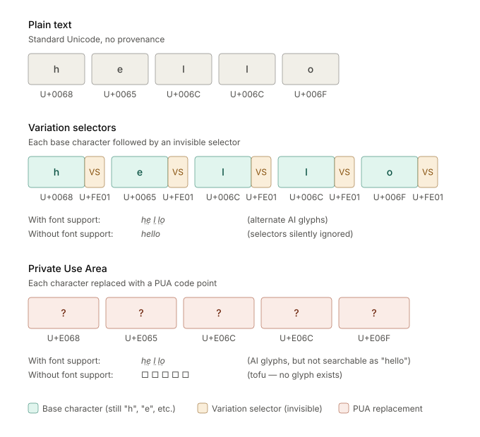

# Unicode, UTF-8, UTF-16, and Space for Future Characters

Unicode is a universal catalogue of abstract characters and related text elements. Each entry has a **code point**, written as `U+` followed by hexadecimal digits—for example, `U+0041` is `A`, `U+00E9` is `é`, and `U+1F600` is 😀.

Unicode defines a finite code space:

$$\text{U+0000 through U+10FFFF} = 1{,}114{,}112\text{ code points}$$

UTF-8 and UTF-16 are different ways to encode those same code points as bytes. Neither provides additional Unicode character capacity; both encode the full Unicode code space.

In Unicode 17.0, 297,334 code points are assigned, while 814,664 remain unassigned (reserved for possible future allocation).[^2bd6fa#4-4]

## Unicode planes

The code space is divided into 17 **planes**, each containing 65,536 code points (`0x10000`).

| Plane | Range            | Name                                | Typical contents                                        |
| ----: | ---------------- | ----------------------------------- | ------------------------------------------------------- |
|     0 | U+0000–U+FFFF    | Basic Multilingual Plane (BMP)      | Most common modern scripts, punctuation, symbols        |
|     1 | U+10000–U+1FFFF  | Supplementary Multilingual Plane    | Many emoji, historic scripts, musical notation          |
|     2 | U+20000–U+2FFFF  | Supplementary Ideographic Plane     | Rare and historic CJK ideographs                        |
|     3 | U+30000–U+3FFFF  | Tertiary Ideographic Plane          | Further rare CJK ideographs                             |
|  4–13 | U+40000–U+DFFFF  | Unnamed/unassigned planes           | Future expansion space                                  |
|    14 | U+E0000–U+EFFFF  | Supplementary Special-purpose Plane | Variation selectors, language tags                      |
| 15–16 | U+F0000–U+10FFFF | Supplementary Private Use Areas     | Private agreements; not standardized Unicode characters |

The **BMP** is Plane 0. It was originally expected that 65,536 positions would be enough for Unicode, so it contains the most widely used repertoire: ASCII, Latin, Greek, Cyrillic, Arabic, Hebrew, Devanagari, Hangul, kana, most common Han ideographs, and much punctuation and symbolism.

The BMP is now densely allocated. Most remaining future capacity is above U+FFFF, particularly in Planes 4–13.

## Reserved areas

Not every unassigned-looking position is available for a future standard character.

| Category                |   Count | Meaning                                                                         |
| ----------------------- | ------: | ------------------------------------------------------------------------------- |
| Surrogates              |   2,048 | U+D800–U+DFFF; reserved permanently for UTF-16                                  |
| Noncharacters           |      66 | Values reserved for internal use, not normal text interchange                   |
| Private-use code points | 137,468 | Available for private agreements, but Unicode will not assign standard meanings |
| Unassigned / reserved   | 814,664 | Space from which future Unicode assignments can generally be made               |

Unicode 17.0 counts 137,468 private-use positions, 2,048 surrogates, and 66 noncharacters.[^2bd6fa#4-4]

## UTF-16 and surrogate pairs

UTF-16 stores text in 16-bit **code units**.

- A BMP code point, U+0000–U+FFFF except the surrogate range, takes **one** 16-bit code unit.
- A supplementary code point, U+10000–U+10FFFF, takes **two** 16-bit code units: a **surrogate pair**.

The surrogate range is U+D800–U+DFFF:

| Part           | Range         |
| -------------- | ------------- |
| High surrogate | U+D800–U+DBFF |
| Low surrogate  | U+DC00–U+DFFF |

A high surrogate followed by a low surrogate represents one code point above the BMP. Neither surrogate has an independent character meaning. Unicode explicitly reserves them for this UTF-16 purpose; there will never be “surrogate characters.”[^2]

For example, 😀 is U+1F600. In UTF-16 it is the two code units:

```text
D83D DE00
```

As bytes, that is `D8 3D DE 00` in UTF-16 big-endian, or `3D D8 00 DE` in little-endian.

This means a UTF-16 string length measured in code units is not necessarily its character count: 😀 is one Unicode code point but two UTF-16 code units.

## UTF-8: no surrogates

UTF-8 encodes each Unicode code point directly as 1–4 bytes.

| Code point range | UTF-8 form                            | Bytes |
| ---------------- | ------------------------------------- | ----: |
| U+0000–U+007F    | `0xxxxxxx`                            |     1 |
| U+0080–U+07FF    | `110xxxxx 10xxxxxx`                   |     2 |
| U+0800–U+FFFF    | `1110xxxx 10xxxxxx 10xxxxxx`          |     3 |
| U+10000–U+10FFFF | `11110xxx 10xxxxxx 10xxxxxx 10xxxxxx` |     4 |

For example:

```text
😀 = U+1F600
UTF-8 = F0 9F 98 80
```

UTF-8 does **not** encode a supplementary character as two 3-byte encodings of UTF-16 surrogates. A valid UTF-8 encoding uses one 4-byte sequence.[^3]

UTF-8 preserves ASCII exactly: `A` is simply byte `41`. Its continuation bytes begin with `10`, making byte sequences distinguishable and recoverable at character boundaries.

## CJK

**CJK** means **Chinese, Japanese, and Korean**. In Unicode discussions, it often refers particularly to **Han ideographs**—characters historically shared or adapted across these writing traditions.

Many common CJK characters are in the BMP, where they require:

- **UTF-8:** 3 bytes
- **UTF-16:** 2 bytes

This is why UTF-16 can be more compact for typical Han text, whereas UTF-8 is generally more compact for ASCII-heavy text. Large collections of rare Han characters are in supplementary planes, where UTF-16 uses surrogate pairs and UTF-8 uses four bytes.

## Capacity conclusion

Unicode has substantial room for growth:

- About **73%** of its total code space remained unassigned in Unicode 17.0.
- Almost all practical new standard assignments will be outside the BMP.
- UTF-8 and UTF-16 have the **same Unicode capacity**: U+0000–U+10FFFF.
- UTF-16’s distinction is representational: characters above the BMP require two code units.
- UTF-8 handles those code points directly with four bytes, without surrogate pairs.

**References**

[^1]: [Unicode Character Count V17.0](https://www.unicode.org/versions/stats/charcountv17_0.html) (58%)

[^2]: [FAQ - Basic Questions](https://unicode.org/faq/basic_q) (15%)

[^3]: [FAQ - UTF-8, UTF-16, UTF-32 & BOM - Unicode](https://www.unicode.org/faq/utf_bom.html) (26%)

## Variation selectors vs Private Use Areas

### Variation selectors

Unicode characters (U+FE00–U+FE0F, U+E0100–U+E01EF) that follow a base character to request an alternate glyph. The base character retains its identity. The selector is invisible and carries no meaning alone. A font with a cmap format 14 table maps the pair (base + selector) to a specific glyph. Without font support, the selector is ignored and the base character renders normally.

### Private Use Area (PUA)

Three reserved Unicode ranges (U+E000–U+F8FF, Planes 15–16) where code points have no assigned meaning. Applications and fonts can assign them to anything. "Degrades to tofu" means: without the specific font that defines glyphs for those code points, the renderer has no glyph to display and shows a fallback rectangle (□ or ▯), called tofu.

### Unassigned plane code points

Planes 4–13 are currently unassigned by Unicode. Code points in these ranges are valid in UTF-8 encoding but have no defined properties: no character class, no case, no directionality. Software may reject, strip, or replace them. Using them is functionally equivalent to PUA but without the Consortium's explicit permission to do so.

---

### ELI5

**Variation selectors:** You write the letter "a" and then whisper a secret instruction after it. If your font knows the secret, it draws "a" differently. If it doesn't know the secret, it just draws a normal "a" and ignores the whisper. The letter is always "a" either way.

**PUA:** Empty rooms in the Unicode building that anyone can use for anything. If you put your own furniture in them, great, but if someone visits without your furniture catalog, they just see an empty room. That empty room is the tofu rectangle.

**Unassigned planes:** Floors of the Unicode building that haven't been built out yet. You could squat there, but the building management hasn't said those floors are yours to use, and the elevator might not stop there.

---



The critical difference: in the variation selector row, `U+0068` is still the letter "h." The selector `U+FE01` whispers "draw me differently" but doesn't change the character's identity. Search for "hello", you find it. Copy it to Notepad, you see "hello." Install the provenance font, you see the AI-styled "hello."

In the PUA row, `U+E068` is not the letter "h" at all. It's a private code point that your font happens to draw as an h-shaped glyph. Search for "hello" fails. Copy to any app without the font and you get five blank rectangles. Screen readers can't pronounce it. Regex `\w` won't match it.

That's the argument you were making. Variation selectors give you graceful degradation: the worst case is ordinary readable text with provenance stripped. PUA gives you opaque failure: the worst case is unreadable.

## Legit official Unicode code points

### Planes

Planes **4–13 are not currently “used” at all**: they have no assigned characters and are held as unallocated Unicode/ISO 10646 codespace for later standardization. Planes 2–3 are the designated additional ideographic planes; Plane 14 is special-purpose; 15–16 are private use. Everything else—thus 4–13—is simply reserved. [^ed4a48#505-520] [^ed4a48#618-624]

They are **not private namespaces** and cannot be allocated by a vendor, font maker, or user. Until Unicode assigns a code point, it should not be given a public interchange meaning; a later Unicode version may assign it.

#### How future allocation would happen

There is no separate “request Plane 7” procedure. Normally, an encoding proposal is for a _script or character repertoire_, not for a plane. Its eventual code-point location—including whether it needs a newly opened supplementary plane—is decided by Unicode and ISO standards bodies.

| Stage                         | What happens                                                                                                                                                                                                                                                                                                                                                                         |
| ----------------------------- | ------------------------------------------------------------------------------------------------------------------------------------------------------------------------------------------------------------------------------------------------------------------------------------------------------------------------------------------------------------------------------------ |
| 1. Establish eligibility      | Show a real user community, stable repertoire, and need for plain-text interchange—not merely a font or glyph collection. [^d33aa2#30-32]                                                                                                                                                                                                                                            |
| 2. Prepare a formal proposal  | Supply repertoire and names, character behavior/properties, evidence and references, comparisons to existing encodings, ordering, a suitable font, and the WG2 proposal-summary form. New-script proposals also address such matters as punctuation, line breaking, and required specification text. [^d33aa2#38-50] [^d33aa2#62-68]                                                 |
| 3. Submit and initial review  | Submit through Unicode’s Script Encoding Working Group process, with the required contributor licence. Inadequate proposals can be rejected before substantive discussion. [^d33aa2#16] [^d33aa2#93-103] [^d33aa2#136]                                                                                                                                                               |
| 4. Technical review           | The Script Encoding Working Group may seek revisions or recommend the proposal to the Unicode Technical Committee (UTC); UTC has the final Unicode decision. [^d33aa2#137-142]                                                                                                                                                                                                       |
| 5. Standardize the allocation | The accepted repertoire and placement are coordinated into Unicode and ISO/IEC 10646 publication processes. The code-point range is selected according to allocation constraints—keeping related characters contiguous, generally observing boundaries for smaller scripts, and, for supplementary characters, generally not crossing 1,024-code-point boundaries. [^ed4a48#542-553] |

The **Unicode Roadmaps** may show prospective blocks, but these are planning aids only: their proposed location and size can change before final allocation and are not an entitlement to any range. [^457ae8#30-34]

So, planes 4–13 would be opened only if future standardized repertoires made that sensible—likely extremely large collections or a category for which existing designated areas were unsuitable—not because an outside party asks to reserve one for its own use.

**References**

[^1]: [Chapter 2 – Unicode 16.0.0](https://www.unicode.org/versions/Unicode16.0.0/core-spec/chapter-2/) (41%)

[^2]: [Script Encoding Working Group - Unicode](https://www.unicode.org/pending/proposals.html) (52%)

[^3]: [Roadmaps to Unicode - Unicode](https://www.unicode.org/roadmaps/) (8%)

### Variation selectors

They solve different problems.

| Mechanism                  | What it provides                                                                     | Example                                                                              | Who defines meaning                                                                              |
| -------------------------- | ------------------------------------------------------------------------------------ | ------------------------------------------------------------------------------------ | ------------------------------------------------------------------------------------------------ |
| **Future-use planes 4–13** | Empty **code-point space** for future _new characters_                               | A future script could receive new code points in a block within one of these planes  | Unicode/ISO standardization process                                                              |
| **Variation selectors**    | A way to request a recognized **variant presentation of an existing base character** | `U+2764` + `U+FE0F` = ❤️ emoji-style heart; `U+2764` + `U+FE0E` = ♥ text-style heart | Unicode’s standardized-variant data, emoji specifications, or the Ideographic Variation Database |

A variation sequence is normally exactly two code points: a base character followed by a selector. It is about restricting glyph choice or distinguishing an approved character variant—not creating an arbitrary new character. [^1] [^2]

So if a proposal needs a distinct letter, symbol, or script character with its own identity and text behavior, it needs **a new encoded character**—potentially eventually consuming space in planes 4–13. A selector is appropriate only where the proposed distinction is a legitimate, narrowly defined variant of a character that is already encoded.

Two important constraints:

- You cannot simply invent `base + VS` pairs for public interchange. Unicode explicitly treats that as analogous to assigning an unassigned code point yourself; only registered/standardized sequences have defined portable meaning. [^3]
- If software or fonts do not support a valid variation sequence, the normal fallback is generally to show the base character and make the selector invisible. [^4]

There are only two ordinary selector ranges: `U+FE00–U+FE0F` (VS1–VS16) and `U+E0100–U+E01EF` (VS17–VS256). [^5] [^6] Thus they offer a constrained mechanism for variants, not a substitute for the roughly 655,000 currently unallocated code points in planes 4–13.

**References**

[^1]: [UTR #28: Unicode 3.2](https://www.unicode.org/reports/tr28/tr28-3.html) (15%)

[^2]: [UTS #37: Unicode Ideographic Variation Database](https://www.unicode.org/reports/tr37/) (10%)

[^3]: [FAQ - Variation Sequences](https://unicode.org/faq/vs.html) (29%)

[^4]: [FAQ - Variation Sequences - Unicode](https://www.unicode.org/faq/vs.html) (23%)

[^5]: [The Unicode Standard, Version 17.0](https://unicode.org/charts/PDF/UFE00.pdf) (13%)

[^6]: [The Unicode Standard, Version 16.0](https://www.unicode.org/charts/PDF/UE0100.pdf) (10%)


#### How future allocation would happen

The defining specification is **The Unicode Standard, §23.4 “Variation Selectors.”** It defines a variation sequence as exactly two code points: an eligible base character followed by a character with the `Variation_Selector` property. Its purpose is glyphic variation—not an open-ended extension space for new characters. [Unicode 17, §23.4](https://unicode.org/versions/Unicode17.0.0/core-spec/chapter-23/) [^e0eb30#321-372]

For interoperable Unicode text, the Consortium recognizes only three registries/lists:

| Sequence kind | Definition / registry | Typical selectors |
|---|---|---|
| Standardized variation sequences | [`StandardizedVariants.txt`](https://unicode.org/Public/UNIDATA/StandardizedVariants.txt), a normative UCD data file | Mainly VS1–VS16 (`FE00`–`FE0F`) |
| Emoji variation sequences | [`emoji-variation-sequences.txt`](https://unicode.org/Public/UNIDATA/emoji/emoji-variation-sequences.txt), specified with [UTS #51](https://unicode.org/reports/tr51/) | VS15 (`FE0E`, text presentation) and VS16 (`FE0F`, emoji presentation) |
| Ideographic variation sequences (IVS) | [UTS #37 / Ideographic Variation Database](https://www.unicode.org/reports/tr37/) | VS17–VS256 (`E0100`–`E01EF`) |

The Unicode Standard is explicit: **only** sequences in those three sources are sanctioned for conformant implementations. For any other `base + VS` pair, the selector must not alter the base character’s visual appearance; it is default-ignorable. [^e0eb30#321-372]

So the two blocks you identify are the general-purpose selector inventories:

- `U+FE00–U+FE0F`: 16 selectors, VS1–VS16.
- `U+E0100–U+E01EF`: 240 selectors, VS17–VS256, allocated specifically for registered ideographic variation sequences. [UTS #37](https://www.unicode.org/reports/tr37/) [^2]

There are also **Mongolian free variation selectors** in the Mongolian block, with script-specific rules; they are not a general mechanism. Unicode §23.4 points to §13.5 for their treatment. [^e0eb30#321-372]

The unallocated positions in planes 4–13 are therefore not “available selector space” under Unicode conventions. They have no `Variation_Selector` property, no specified parsing/rendering semantics, and may later be assigned by Unicode. A private system can give them private semantics, but then it is a private encoding convention, not a Unicode-standard variation-sequence mechanism—and is unsuitable for general interchange.

**References**

[^1]: [Chapter 23 – Unicode 17.0.0](https://unicode.org/versions/Unicode17.0.0/core-spec/chapter-23/) (74%)
[^2]: [UTS #37: Unicode Ideographic Variation Database](https://www.unicode.org/reports/tr37/) (26%)
