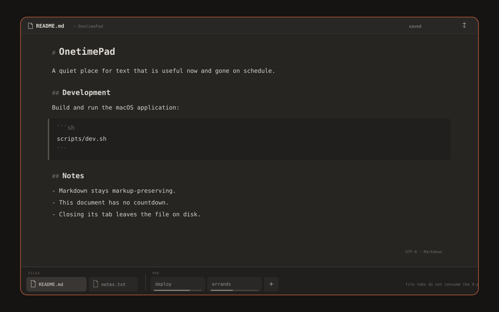
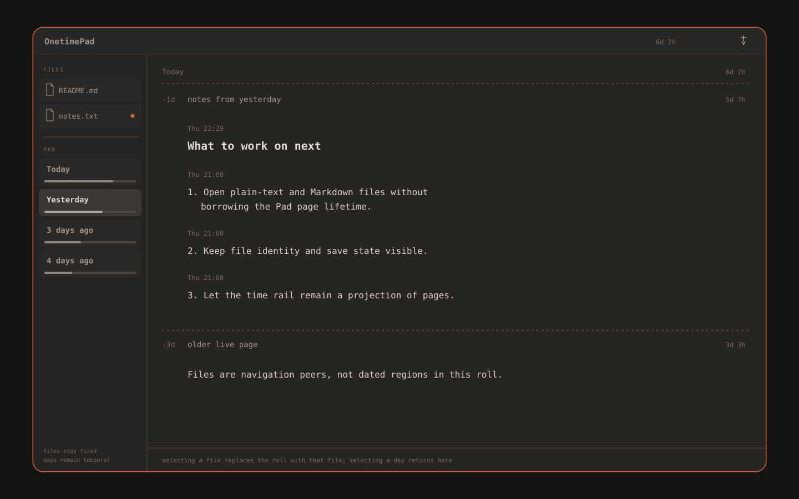

# Feature: file backed documents on the pad

Status: **landed** on `feature/regular-text-files`, decision still
proposed · 2026-09-05
Scope: an additional content class, a peer to pages, with both first
class features of the pad. The pad can open a plain
text or Markdown file from disk, edit it in the same editor a page
uses, and save it back on an explicit request. Pages, their TTLs, the
strip, the day roll and the sealed page format are untouched.
Governs against:
[`../../design/03-design-principles.md`](../../design/03-design-principles.md)
(§1 comfortable being temporary, §3 content plays second fiddle, §4
frugal),
[`../../design/04-interaction-model.md`](../../design/04-interaction-model.md)
(Markdown: styled, never rewritten, and the keyboard map),
[`../../design/05-technical-direction.md`](../../design/05-technical-direction.md)
(the accessibility commitments),
[ADR-0001](../../../adr/0001-rust-core-thin-shell.md) (a Rust core
under a thin shell),
[ADR-0010](../../../adr/0010-form-factors-as-sibling-targets.md) (form
factors as sibling targets),
[ADR-0016](../../../adr/0016-content-persists-across-restart.md)
(unexpired staged content survives restart and crash),
[ADR-0017](../../../adr/0017-durable-tabs-expiring-pages.md) (durable
tabs, expiring pages),
[ADR-0020](../../../adr/0020-a-day-is-a-projection-of-live-pages.md) (a
day is a projection of live pages) and
[ADR-0021](../../../adr/0021-multi-device-sync-over-a-blind-relay.md)
(what the relay carries).
Decision:
[ADR-0028](../../../adr/0028-file-backed-documents-are-a-peer-content-class.md),
**proposed**.
Issue: not yet filed.

This describes what the branch implements. ADR-0028 is still proposed,
so the decision behind it is not accepted, and no statement here is a
guarantee the project has made. How the pieces fit together in the code
is
[`../../../development/about-file-backed-documents.md`](../../../development/about-file-backed-documents.md).

## The problem

Dogfooding puts two kinds of text in front of the same person in the
same hour. One kind is the pad's own: a note that is useful now and
gone on schedule, staged, sealed, standing in a slot on the strip,
carrying a countdown. The other kind is a file that already exists on
disk and is expected to still exist next year: a README, a scratch
`notes.txt`, a config snippet, a draft the person keeps in a git repo.

Today the second kind has nowhere to go. Opening it means leaving the
pad for another editor, which means the pad is not the place the
person's text lives, only the place some of it visits. The friction is
small and constant, and it is the kind of friction that decides whether
a tool becomes a habit.

### Why a peer content class rather than a page with no TTL

The obvious shortcut is to let a page hold a file and give that page an
infinite TTL. It is the wrong shape for four reasons.

1. **The TTL is load bearing everywhere.** ADR-0017 makes expiry a
   property of the page, and ADR-0020 buckets days by live pages. A
   page whose countdown never ends is a special case in the gauge, the
   rail, the day projection, the ledger and the rotation predicates in
   ADR-0016. Every one of those places would grow a branch for content
   that behaves nothing like a page.
2. **The artifact is different.** Tenet 2 says the stored artifact is
   the contract, not the app's scratch state. For a page the artifact
   is the sealed state file the pad owns. For a file the artifact is
   the file on disk, which the pad does not own, which other programs
   write, and whose lifetime nobody asked the pad to manage.
3. **Forgetting stops being honest.** The pad's forgetting is
   trustworthy because it is on schedule and never accidental. A class
   of pages that never expires makes the countdown a suggestion rather
   than the rule, and a reader can no longer tell by looking whether
   what is on screen is on a clock.
4. **The strip means something.** Its slots are a working set of
   temporary notes. Files are not that. Putting an open README on the
   strip would make the strip a picture of a person's editor rather
   than of their staged content. (When this was written the strip had
   a cap of nine; issue #158 removed it, and the separation stands on
   its own.)

So: two classes, visibly grouped, sharing one editor and one window,
sharing nothing else.

## What a file is, and what it is not

A file backed document is an editing view over a file on disk. The file
on disk is the artifact, per tenet 2. The pad holds a view of it and,
while there are unsaved edits, a draft of it. Neither the view nor the
draft is the thing of record. If the app never runs again, the file is
still there, unchanged since the last save, readable by every other
program on the machine.

A file is not a page. It has no TTL, no gauge, no rung, no hold, no
chips, no conceal action against it as a whole, and no place in the day
roll. It is not staged content in the sense ADR-0016 uses, and no
statement in ADR-0016 or ADR-0017 about staged content is being
extended to cover it here.

Proposed v1 shape: one file per tab, plain text and Markdown only, no
directory browser, no project sidebar, no multi file search. The pad is
not becoming a code editor. It is becoming a place where the file you
are looking at can be one of your files.

## Opening

Three ways in, all of them explicit.

- **Open panel.** File > Open raises the standard macOS open panel,
  filtered to plain text and Markdown. The panel is the shell's job.
- **Drag onto the pad.** Dropping a file onto the pad opens it. A drop
  of several files opens each in its own tab. A drop of a file type the
  pad does not open is refused with a notice naming the type, and
  nothing is inserted into the page under the cursor. This matters:
  dropping a file must never silently turn into pasting its bytes into
  a staged page.
- **Reopening on relaunch.** The pad remembers which files were open,
  in what order, with what selection, and reopens them at launch. It
  remembers them by URL bookmark, so a file that moved or was renamed
  is still found. The app is not sandboxed today, so a plain bookmark
  is what it takes and what it uses. Bookmarks are created, resolved
  and accessed through one function in the shell, so the security
  scoped variant is a small change when the sandbox arrives with
  TestFlight. Nothing in this specification claims sandbox access
  exists now. A bookmark that no longer resolves leaves the tab in a plain
  unavailable state naming the last known path, with an action to
  locate the file and one to close the tab. It never silently
  disappears and never recreates the file.

Opening a file does not create a page, does not take a slot on the strip,
and does not start any clock.

## Editing

The same editor as pages, with the same rules. Markdown stays markup
preserving: headings, fences and links are styled, never rewritten
(design doc 04). Syntax coloring inside fenced blocks is display only,
under the same contract ADR-0024 sets for the page. List automation
follows the same caret only law. Select all and copy returns exactly
the bytes in the buffer.

Two deliberate differences from a page:

- **No block metadata is surfaced for a file.** The created and
  modified stamps that ADR-0013 and ADR-0025 give a page's blocks are a
  property of the pad's own document model. A file has no such history,
  the pad is not going to invent one, and it is certainly not going to
  write one into the file. Files show no stamps and no revision
  affordances.
- **No conceal.** Concealing turns staged content into a one time link
  (ADR-0007). That verb belongs to staged content. Selecting text in a
  file and concealing the selection is a plausible future, but it is
  out of scope for v1 and is listed as an open question.

Undo history is per document and per tab, keyed to the open file, and
is discarded when the tab closes.

## Saving

Saving is explicit. There is no autosave to the file.

- **Cmd S** writes the buffer to the file. The write is atomic: the
  bytes go to a temporary file in the same directory, are flushed, and
  are then renamed over the target, so a crash or a full disk leaves
  either the old file or the new one and never a truncated one. The
  file's permission bits are preserved across the replace, and a file
  opened through a symlink is resolved to the real file when it opens,
  so the save lands on that file and the link stays a link. Be plain
  about what a replace cannot carry: the new file is a new inode, so a
  second hard link to the old one keeps pointing at the old text, and
  extended attributes and any ownership the writer cannot set do not
  survive. A file that is one of several hard links, or that carries
  tags or other extended attributes, will lose them on the first save.
- **Save As** raises a save panel, writes to the chosen location, and
  the tab follows the new file. A new bookmark is taken. The original
  file is left exactly as it was. Save As onto a path another open file
  already holds is refused before anything is written, because two tabs
  over one file would race each other's saves.
- **State.** The header shows the filename and one of two words:
  saved, or unsaved. A small orange dot on the tab or shelf row means
  that file has unsaved changes. The dot appears on the first edit that
  changes the bytes and clears on a successful write. A write that
  fails leaves the dot, keeps the draft, and shows the failure with its
  reason, for example a read only volume or a permission denial.
- **Quit with unsaved changes.** Quitting with a dirty file open says
  so, once, and names the files. The staged draft is sealed into the
  app's own state before the app exits, and the next launch reopens the
  file with the draft restored and the unsaved dot still showing. The
  file on disk is not written.

  The notice is not the macOS save or discard sheet, and the difference
  is the point. It offers Quit Anyway and Cancel and no third button,
  because the draft survives the quit either way: a Discard here would
  manufacture the one loss path this feature does not have, at exactly
  the moment a person is dismissing dialogues by reflex, and tenet 1
  says losing work is unforgivable. Cancel exists so Cmd S is one
  keystroke away. It appears only when a file is actually dirty, so a
  quit with nothing at stake is still silent.

  What the pad owes beyond the notice is that the unsaved state is
  unmistakable at the next launch. So a restored dirty file shows the
  time of its last edit in the header beside the dot, and a person can
  judge the draft's age before pressing Cmd S.

  When the pad's own state write fails at the same quit, the notice
  drops the restoration promise and says the typing is in memory only,
  because on that branch it is (`QuitPrompt`).
- **An unsaved draft survives relaunch and crash.** The draft lives in
  the app's own sealed state, in a separate sealed drafts file under
  the same content key as the page snapshot, and it is never written to
  the file until the person saves. The pad will not modify a person's
  file without being asked, and it will not lose their typing because
  they did not ask in time. The draft is keyed to the file's bookmark,
  so it reattaches to the right file at the next launch.
- **A draft lives exactly as long as its tab.** It survives relaunch
  and crash because the tab does. It does not survive the tab closing.
  Reopening a file after a close never brings back edits from an
  earlier session.

### What can drop a draft

Three things drop a draft and nothing else does: a successful save,
Discard in the close review, and an explicit erase of the drafts file.

The one that needs saying out loud is what does not drop one. The pad
erases its content key automatically when no tab holds a page, which is
a page lifecycle event and can happen while a person is holding a dirty
file tab. When any file is open, that erase rewrites the drafts under
the key it just minted rather than dropping them. There is no Clear or
Empty confirmation in the app today that could name the drafts it would
discard, because that erase has no prompt in front of it. If such a
prompt is ever added, naming the affected files by filename is what it
owes.

### The drafts bound

A draft is not the file's text. It is the editing history behind the
text, so a long session on a small file can produce a large draft. The
drafts file therefore has its own bound, four times the file size
limit, so 16 MiB.

A draft above the bound is not written. That file's record is written
as identity only, so the tab comes back at the next launch pointing at
the file on disk, and a notice names the file whose draft was dropped.
Every other open file's draft is written as normal: one oversized draft
must not take the rest with it.

Refusing at open time instead would not remove this path. The bound is
about how much editing has happened, which no check at open can see,
and refusing every file that might one day exceed it would refuse every
file. So the bound is a live path with an honest notice rather than a
guarantee that it never fires.

Draft staging is the reason file support is not simply an
`NSDocument` shaped feature. See the alternatives in ADR-0028.

## External changes

Files change under the pad. Another program writes them, a git checkout
swaps them, a sync client replaces them.

The pad checks the file on two occasions: when the app becomes active,
and immediately before any save. Checking means comparing the file's
identity and modification stamp, and a content digest when the stamp
looks changed, against what was read.

- **The tab is clean** (no unsaved edits) and the file changed on disk:
  reload without asking, then always post a notice saying the file was
  reloaded. The view updates and the selection is kept where it can be.
  There is nothing to lose, so there is nothing to ask, but a person
  whose view just moved is owed the reason.
- **The tab is dirty** (unsaved edits) and the file changed on disk:
  the tab enters a conflict state. Editing is not blocked, but the
  header says the file changed on disk and offers three actions:
  - **Keep mine.** Write the buffer over the file, discarding the disk
    version. Choosing it takes a fresh reading of the file being
    overwritten and licenses exactly one save. The check the pad makes
    before every write does not undo the choice, and the save spends
    it, so a second conflict later asks again.
  - **Take theirs.** Replace the buffer with the file, discarding the
    draft. This one asks for confirmation, because it is the only
    action here that destroys the person's typing.
  - **Save As.** Write the buffer somewhere else and leave both the
    original file and its new content intact. This is the safe exit and
    is the default focus.

  Save is refused while the tab is in conflict, until one of the three
  actions is chosen.
- **The file was deleted or moved** while open: the tab keeps its
  buffer, says so, and offers Save As. The pad does not recreate a file
  at a path a person deleted.

No merge, no diff view, no three way resolution in v1.

The activation check runs on every route by which the app becomes
active, the Dock icon click that reopens an already active app
included.

### Restoring open files at launch

The drafts file records what was open. It does not record a clean
file's text, only its identity, so the pad reads each file from disk at
launch and settles each tab into one of six states.

| the record | the file on disk | what happens |
| --- | --- | --- |
| clean | unchanged | filled from disk, clean, nothing said |
| clean | changed | filled from disk, clean, reload notice |
| clean | missing or unreadable | tab dropped, notice naming the file |
| dirty | unchanged | draft kept, last edit time preserved, and the disk copy learned so that undoing back to it reads as saved again |
| dirty | changed | draft kept, tab opens in conflict |
| dirty | missing | draft kept, tab opens in conflict |

One unreadable file never fails the whole restore. Each record is
settled on its own, so a file on an unmounted volume costs its own tab
and no other.

## Closing a tab

Closing a file tab leaves the file on disk exactly as it is. Nothing is
written and nothing is deleted.

Closing a dirty file tab raises the standard macOS review, with three
actions:

- **Save** writes the file and closes the tab.
- **Discard** closes the tab and destroys the draft. It names the file
  it is discarding.
- **Cancel** leaves the tab open with its draft intact.

A draft therefore lives exactly as long as its tab. It is destroyed by
a save, by a discard, or by an erase of the app's state, and by nothing
else. There is no path by which reopening a file resurrects unsaved
edits from an earlier session, which also means no Cmd S can ever write
typing a person has forgotten about.

## Layout

Both mockups in `mockups/` show the same rule: files and pages share
the navigation surface and stay visibly grouped.

### Horizontal tabs

- Open files and pad pages share the bottom navigation surface but
  remain visibly grouped, with a FILES group before the PAD group.
  Files sort in the order they were opened, and never reorder
  themselves.
- A file tab uses its filename and a document icon. It has no TTL
  gauge.
- Pad tabs keep their existing names, gauges and `+` action. File tabs
  take no slot on the strip.
- The active file's identity and save state appear in the header, with
  the encoding and format shown quietly beside them, for example
  `UTF-8 · Markdown`.

### Vertical time tabs

- Open files occupy a fixed **Files** shelf above the temporal **Pad**
  section, in open order.
- Files are not assigned to days and never enter the continuous time
  roll. They are navigation peers, not dated regions.
- Selecting a file replaces the roll with that file alone. Selecting a
  day returns to the roll, with the roll's scroll position preserved.
- With no files open, the existing time rail layout is unchanged, so a
  person who never opens a file sees no difference.
- The rail's minimap and its day labels describe pages only. A file row
  contributes nothing to either.

## Encoding and size

**Proposed: UTF-8 only in v1. A file that is not valid UTF-8 is
refused, not opened read only.**

The refusal names the reason in plain words: the pad cannot read this
file's text encoding, so it will not open it. It offers to reveal the
file in Finder and nothing else.

Why refuse rather than open read only. A read only mode is a second
editing mode with its own state, its own affordances, its own bug
surface and its own explaining to do, built for a case that is rare on
a modern Mac. Worse, a read only tab is a trap under tenet 1: a person
types into it, or believes they can, and their work has nowhere to go.
A flat refusal is honest, is one sentence to document, and leaves the
door open to add real encoding support later without having to unwind a
half feature.

A UTF-8 byte order mark is accepted, preserved on save, and not shown.
Line endings are detected on open, LF or CRLF, preserved on save, and
shown in the header when they are not LF. A file with mixed line
endings is opened and changed only on the lines the person edits, under
the caret only principle.

**Only regular files are opened.** A directory, a device node or a
named pipe at the path is refused rather than read. A pipe is the one
worth naming: reading one blocks until a writer appears, and a pad that
hangs on a drop is worse than one that refuses it. A symlink is not in
this category. It is followed once, at open, and the tab holds the real
file behind it.

**Files larger than 4 MiB are refused**, with a notice naming the file
and naming the limit. The limit is one constant in the core, so the
shell and any sibling form factor refuse the same file. 4 MiB is far
above any plain text or Markdown file a person edits by hand and far
below the point where holding the whole buffer in memory and rewriting
it on every save stops being reasonable.

## What files never do

This is the list that keeps the two classes apart. A file backed
document:

- has no TTL and no countdown, and no mechanism in the pad ever
  destroys its contents;
- shows no gauge, in either layout;
- never appears in the day roll and is never bucketed into a day
  (ADR-0020 buckets live pages, and a file is not one);
- takes no slot on the strip;
- is never sent over the sync relay, in any form, including its name,
  its path, its bookmark, its contents and its draft. ADR-0021's
  channel carries page key frames and page deltas. Files are not in its
  scope and this specification does not add them;
- is never treated as a page by persistence or sync. It does not enter
  the page snapshot's object graph, it does not participate in key
  rotation predicates such as no tab holds a page or no tabs remain, it
  is not part of the ledger, and it produces no chips.

Drafts are the one place a file's bytes enter the pad's own sealed
state. They live in their own sealed drafts file, keyed by bookmark,
outside the page snapshot entirely, under the same content key. The
drafts file is rewritten under the new key whenever that key rotates,
including the automatic erase that fires when no tab holds a page, so a
page lifecycle event never destroys a file's unsaved edits. The
rotation predicates that ask whether any tab holds a page are neither
triggered nor blocked by the presence of drafts.

## Keyboard and menu surface

The keyboard map is a file, not code:
`shell/Sources/CompanionKit/Resources/default-keymap.json`, read with
two JSON5 tolerances, is the source of shortcuts, and the menu shows
whatever that file binds. See
[`../../../development/about-the-keymap.md`](../../../development/about-the-keymap.md).

**Nothing here rebinds an existing chord, and no new context is
added.** All four bindings live in the `Editor` context, which is the
only context the app consults today. This settles what an earlier draft
of this document left open.

Two existing command ids gain a second reading, which is what the
registry already does elsewhere when one intent means two things
depending on the surface:

- **`state::SaveNow`**, bound to Cmd S. On a page target it flushes
  sealed page state, exactly as it does today. On a file target it
  writes the file. The raw id is published contract and is not
  changing, and Cmd S is not being rebound to a second id.
- **`page::Close`**, bound to Cmd W. On a file target it closes the
  file, raising the Save, Discard or Cancel review when the tab is
  dirty.

Two ids are new:

- **`file::Open`**, bound to Cmd O, raises the open panel.
- **`file::SaveAs`**, bound to Cmd Shift S, raises the save panel for
  the active file.

The app gains its first **File** menu, listing Open, Save, Save As and
Close File, and reading each chord from the keymap rather than spelling
it in the menu code. Save, Save As and Close File are inert when the
active tab is a page rather than a file.

## Accessibility

- Every file tab and shelf row exposes a label that names the file and
  its save state in words, not by the dot alone. The unsaved dot is a
  redundant cue, never the only one.
- The conflict state is announced when it appears, and its three
  actions are reachable in the keyboard order they are read in.
- Save failures and refusals are announced, not only drawn.
- The Files and Pad groups are exposed as named groups, so a screen
  reader user hears which class they are moving through.
- The dot's colour is never the only way to tell unsaved from saved,
  which keeps the surface usable at any colour vision and in high
  contrast.
- Everything here inherits the commitments in design doc 05; this
  section names only what is specific to files.

## Marker vocabulary

- A small orange dot on a file row means that file has unsaved changes.
- A file row never shows a countdown gauge.
- Pad rows and tabs retain their existing countdown gauges.

## Open questions

1. **Conceal from a file.** Should selecting text inside a file and
   concealing the selection be allowed? It is coherent, since conceal
   acts on bytes, but it makes a file an ingress into staged content
   and needs its own argument.
2. **How many files.** Is there a cap on open files at all, and if so
   what is it and why? Pages have no cap since issue #158, and nothing
   caps files either today.
3. **Encoding, later.** If UTF-8 only proves too narrow, what is the
   smallest honest next step: detection with conversion on save, or an
   explicit reopen with encoding chooser?
4. **Recent files.** A recents list is convenient and is also a durable
   record of filenames the pad keeps. Worth it?
